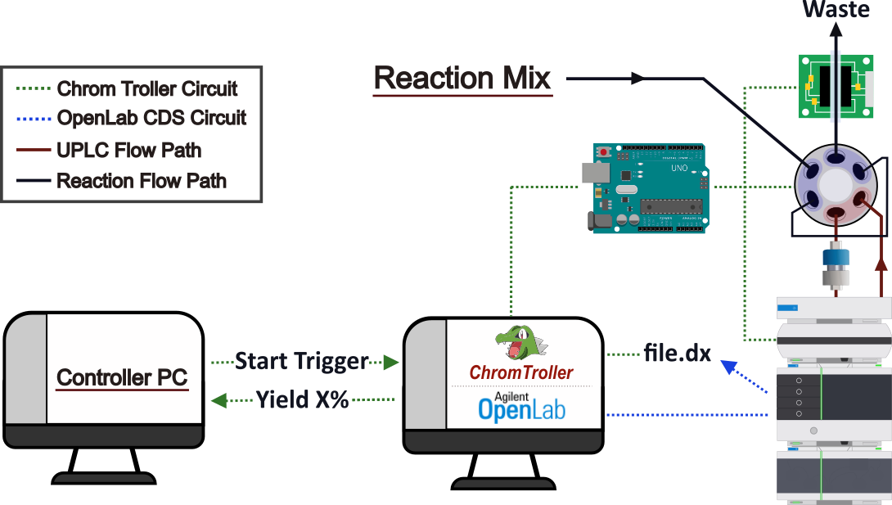
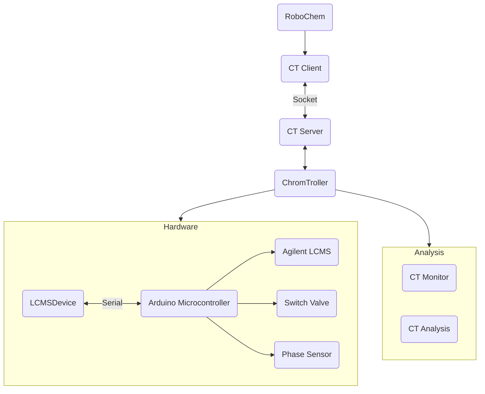

#  ChromTroller

## Overview
ChromTroller (short for Chromatogram Aquisition Controller) is an automated control and analysis package for triggering an Agilent UPLC-MS system
(via a microcontroller) and automatically analysing the resulting data.

### Software
- A server interface to communicate with an external control program/PC (network or localhost)
- Software to trigger the hardware components 
- Arduino microcontroller sketch to convert the software commands to simple digital outputs
- Data Analysis software based on MOCCA2 by the Bayer Group (https://github.com/Bayer-Group/MOCCA)
- Agilent UPLC-MS methods (sample prep, and run). The sample prep method is important as it provides the necessary feedback signals from the UPLC.

### Hardware
The LCMS unit is composed of:
- Agilent 1290 Infinity II UPLC-MS
- VICI switch valve controlled by a VICI Two Position Actuator Controller
- OCB350 phase sensor board
- Arduino Uno R3 microcontroller.

---
## Installation and Setup
pip install server side to server computer ...
conda env...
Arduino IDE ...
Wire pins to Ard and set the pins in the Ard code...
Flash Arduino code and identify COM port ...
config file setup ...
    set COM for Serial comm with Ard in python prog ...
    set the host, port and user/password for the server side...
start server ...
Calibrate phase sensor to empty

---
## Useage

Client example code

---
## Platform

---

## Code Structure
The codebase is built in 3 parts: the **Arduino code** (found in the Arduino Sketches directory), the **device** programs, the **controller** program and the **server** program.

### LCMS Server
The **server program** allows Server-Client type communication between this system and an external program through a socket.

This architecture is designed to improve the independence of the UPLC-MS module by creating a generic server which can be connected to by any device and handles all of the more complex comands independantly of the external program.
Helps isolate the LCMS with the socket communication allowing the client to operate independently, which is helpful in dealing with the 32 vs 64 bit issues encountered in the robochem platform.

### LCMS Controller
The **device programs** act as the pyhton-side interface with the Arduino and is split into `ArduinoDevice` and `LCMSDevice`. 
The `ArduinoDevice` contains basic Arduino operations (e.g. open/close connection, send/read data, etc...) while `LCMSDevice` inherits the `ArduinoDevice` class and contains methods specific to the instrument (e.g. set valve to position X, start LCMS run, read phase sensor, etc...).
The **control program** controls the complex behaviour for the system (e.g. runs a seperate thread to monitor the phase sensor data, runs checks to ensure analysis is only triggerred under set conditions, takes user commands and calls the desired method, etc...).

### Arduino Microcontroller
allows communication between the PC (Serial) and the hardware (Digital I/O) and incldes the nessessary comands/responses for the Arduino. 

The arduino sketch is built to take serial commands as 

The device is controlled via serial-through-USB using human readable commands with the following syntax:

- `Sx=y` 
Set variable x to value y. Variable numbers are integer, values type depends on the variable. 
- `Rx` 
Read variable x and print its value to serial. 

---
## License

---
## Acknowledgements
Bayer Group for the MOCCA 2 Package (https://github.com/Bayer-Group/MOCCA)

---
*Author: ***Olly Bayley*** <o.m.bayley at uva.nl>,* ***Noël Research Group, 2024***