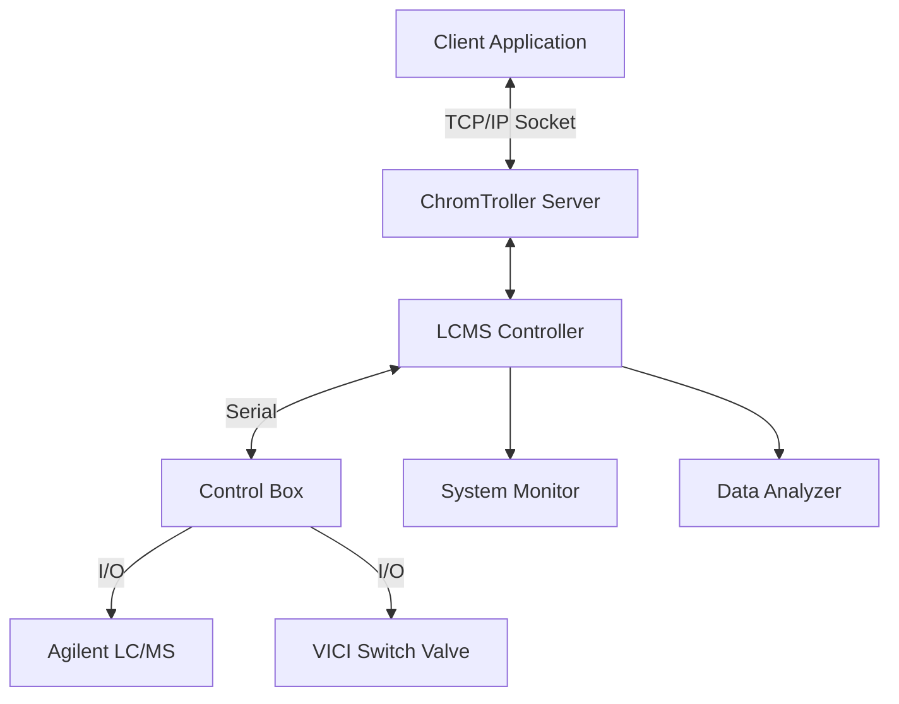

#  ChromTroller

> ***"Pressure makes diamonds"***  
> — *George S. Patton Jr.*
---

## 🧪 Overview
**ChromTroller** (Chromatogram Acquisition Controller) is an automated control‑and‑analysis package that triggers an **Agilent 1290 Infinity II UPLC‑MS** via an **Arduino** and automatically analyzes the resulting chromatographic data.  
It integrates LC/MS hardware (valves, sensors) with a remoteable client–server app and a robust analysis pipeline (MOCCA‑based), making it easy to slot an Agilent UPLC into automated workflows.

ChromTroller was developed to bridge **OpenLab CDS v2.8** (which lacks macro automation) with external experiment controllers (e.g., **RoboChem**) by providing **hardware control**, **data analysis**, and **TCP/IP communication** between PCs.

---

## 📋 Table of Contents

- [Installation](#️installation)
  - [Dependencies](#-dependencies)
  - [Environment Setup](#-environment-setup)
  - [Hardware & Firmware](#-hardware--firmware)
- [Usage](#️usage)
  - [Prepare](#prepare)
  - [Start the Server](#start-the-server)
  - [Configure Settings](#configure-settings)
- [HPLC System Details](#-uplc-system-details)
- [Automation & Connectivity](#-automation--connectivity)
- [Project Structure](#-project-structure-simplified)
- [Architecture](#-architecture)
- [Troubleshooting](#-troubleshooting)
- [Contributing](#contributing)
- [License](#license)
- [Acknowledgements](#acknowledgements)
- [Author](#author)

---

## ⚙️ Installation

### 📦 Dependencies
Before proceeding, make sure you have:

- [**Python 3.8+**](https://www.python.org/downloads/) *(Recommended: Python 3.13)*
- [**Conda**](https://www.anaconda.com/download) *(Recommended: install via Anaconda)*
- [**Git**](https://git-scm.com/downloads)
- **Arduino IDE** from [arduino.cc](https://www.arduino.cc/)
- **Agilent OpenLab CDS v2.8** (instrument control)
- *(Optional)* A Python IDE (e.g. [**PyCharm Community Edition**](https://www.jetbrains.com/pycharm/download/?section=windows))

*Conda helps isolate project dependencies to avoid version conflicts across Python projects.  
Git enables version control and easy updates to the codebase.*

---

### 🧪 Environment Setup
Create and activate the Conda environment from the provided spec:

```bash
conda env create -f .config/ChromTroller_env.yml
conda activate ChromTroller
```

---

### 🧠 Hardware & Firmware
1) **Assemble & wire hardware**  
   Follow the **control box** assembly guide in [`assembly_readme.md`](assembly_readme.md).

2) **Upload the Arduino sketch**  
   - Board: **Arduino Uno R3**  
   - Connect via USB and select the correct **COM** port in the Arduino IDE.  
   - Upload the firmware from `src/arduino_sketches/`.

3) **Supported peripherals**  
   - **VICI** two‑position six‑port switch valve (with micro‑electric actuator & controller)  
   - **OCB350** phase sensor board  
   - Agilent **1290 Infinity II UPLC‑MS**

---

# ▶️ Usage

### Prepare
- Ensure **OpenLab CDS v2.8** is installed and the instrument is available on the **instrument PC**.
- Connect the **Arduino Uno R3** over USB; note the assigned **COM** port.
- Verify valves and sensors are wired and powered.
- Confirm file paths (raw data, results) are accessible by the account running ChromTroller.

### Start the Server
Launch the ChromTroller server on the instrument PC:

```bash
python ChromTroller.py
```

This exposes a **TCP/IP socket** for remote clients (e.g., RoboChem) while handling low‑level device control and data analysis.

### Configure Settings
Copy the example settings and customize for your setup:

```text
src/settings_files/example_settings.json  →  src/settings_files/settings.json
```

Key fields to adjust:
- **Hardware**: Arduino **COM** port, valve positions, timeouts  
- **Analysis**: Peak detection/integration parameters, baseline correction, wavelength ranges  
- **Paths**: Project directories, file naming, raw data / results locations  
- **Targets**: Retention times and tolerances for peak assignment

---

## 🔬 UPLC System Details

**Instrument:** Agilent 1290 Infinity II series with:  
- **High Speed Binary Pump** (G7120A)  
- **Vial Sampler** (G7129B)  
- **Thermostated Column Compartment** (G7116B)  
- **Diode Array Detector** (G7117B, DAD)  
- **InfinityLab LC/MSD XT** Single Quadrupole detector (G6135C)

**Injection hardware:** External **VICI** two‑position six‑port valve with a **1.0 µL** stainless‑steel loop (≈ 90 mm × 0.12 mm). Effective injected volume ≈ **1.4 µL** due to additional valve dead volume.

---

## 🔗 Automation & Connectivity

**OpenLab CDS v2.8** controls the UPLC but lacks a macro language for automation. **ChromTroller** fills this gap by providing:

1. **Hardware control** (valve actuation, ERI digital I/O, phase sensor).  
2. **Data analysis** (see next section).  
3. **Intersystem communication** (TCP/IP sockets).

### Sample Injection & Triggering
- A VICI valve is installed **between the vial sampler and column**.  
- **Position “load”** fills the loop from the external process at low pressure; **position “inject”** places the loop inline for analysis.  
- The **VICI actuator** is driven from the control box; the **UPLC acquisition** is triggered via **Agilent ERI** digital input.  
- In OpenLab, a **Sample Prep** method is configured to **wait for an external trigger** (e.g., “pin 1”). Runs can be queued and started only when the **START REQUEST** signal is received from ChromTroller/Arduino.

This ensures **tight timing** between valve switching and acquisition start, improving retention‑time reproducibility and peak shapes.

### Serial Protocol (to Control Box)
Commands are human‑readable:
- **Set:** `Sx=y` (no response unless specified)
- **Read:** `Rx` (always returns value)

Key variables include: valve position (`5`, 0=A / 1=B), **START REQUEST** (`6`), **STOP** (`7`), **READY** (`8`), **phase sensor** (`9–10`), and ERI **state lines** (`11–13`). See [`assembly_readme.md`](assembly_readme.md) for the full table.

---

## 🧠 Data Analysis

ChromTroller includes a processing pipeline based on the [**MOCCA**](https://github.com/Bayer-Group/MOCCA) package from the BAYER group.
This analysis system parses the raw files, automatically processes the chromatograms contained within , and returns tidy results (e.g., a pandas DataFrame). Operations include:
- file parsing and dimensional reduction  
- baselining and peak picking  
- deconvolution, integration, and quantification  
- identity assignment and error analysis

This enables multi‑wavelength chromatograms to be consumed by external platforms (e.g., RoboChem) as simple peak integrals.

---

## 📂 Project Structure (Simplified)

```
ChromTroller/
├── .config/                 # Conda environment specs
├── docs/                    # Documentation & diagrams
├── reference_spectra/       # Reference spectra for analysis
├── reference_spectra_db/    # Spectra database
├── results/                 # Latest analysis results
├── run_logs/                # Runtime logs
├── saved_results/           # Archived analysis runs
├── src/                     # Source code
│   ├── ct_components/       # Core components
│   │   ├── devices/         # Device interfaces
│   │   └── mocca2/          # MOCCA-based analysis
│   ├── arduino_sketches/    # Arduino firmware
│   └── settings_files/      # JSON configuration
├── ChromTroller.py          # Entry point (server)
├── assembly_readme.md       # Control box build guide
└── README.md
```

---

## 🧱 Architecture



---

## 🛠️ Troubleshooting

**Connection issues**
- Confirm the **COM** port in `settings.json` matches Device Manager.
- Ensure **Arduino drivers** are installed and the board is detected.
- Close any program using the serial port (Arduino Serial Monitor, etc.).

**Acquisition/trigger issues**
- Verify the OpenLab **Sample Prep** method waits for the correct **ERI pin**.
- Check grounds/common reference between ERI and control box.
- Confirm valve position changes acknowledge back to the host.

**Analysis errors**
- Verify raw data paths and filenames match LC/MS export settings.
- Check analysis parameters (peak detection, baselining) against your method.
- Ensure **reference spectra** exist and are correctly formatted.

---

## Contributing
Contributions are welcome—please open a Pull Request with a clear description of your changes.

---

## License
This project is licensed under the **MIT License**. See the `LICENSE` file for details.

---

## Acknowledgements
- **Bayer Group** for the **MOCCA** package
- **Agilent Technologies** for instrument support

---

## Author
**Olly Bayley** — *Noël Research Group, 2024* — <o.m.bayley@uva.nl>
